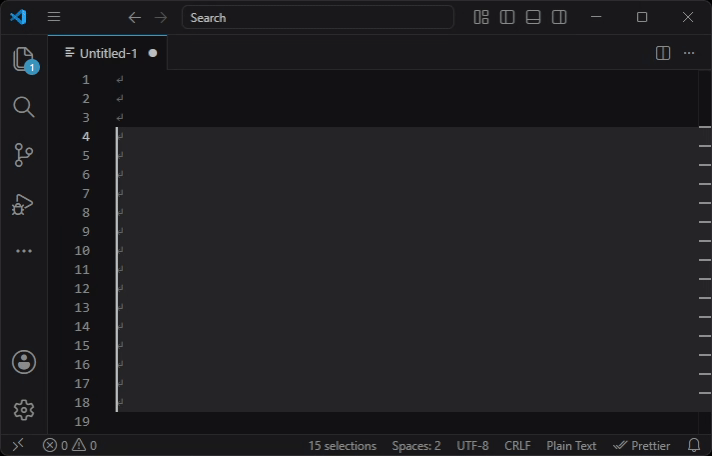

# README

## Insert Numbers Ex for Visual Studio Code

[](https://github.com/sponsors/almiraj/)

An extension to insert increasing numbers.



## Usage

* Command: `Insert Numbers Ex`
* Keybindings: `ctrl+alt+n` on Windows and Linux or `cmd+alt+n` on macOS

## Settings

No settings required. No more `settings.json`.

## Caution

VS Code's Command Palette may ignore leading spaces in the input.

If you need space padding, include another visible character in the pattern, such as `[ 1]`.

## Thanks

Thanks to Asuka for the original [Insert Numbers](https://marketplace.visualstudio.com/items?itemName=Asuka.insertnumbers) extension, which I have long loved.

This project is a small tribute to that work.

## Examples

```text
0
1
2
3
...
```

```text
1
2
3
4
...
```

```text
01
02
03
04
...
```

```text
 8    [ 8]
 9    [ 9]
10    [10]
11    [11]
...
```

```text
1.    1_    (1)
2.    2_    (2)
3.    3_    (3)
4.    4_    (4)
...
```

```text
0b01     0o06    0x0e    0X08
0b10     0o07    0x0f    0X09
0b11     0o10    0x10    0X0A
0b100    0o11    0x11    0X0B
...
```

```text
１    一    ①    ٠    ०    Ⅰ
２    二    ②    ١    १    Ⅱ
３    三    ③    ٢    २    Ⅲ
４    四    ④    ٣    ३    Ⅳ
...
```

```text
a    A    α    а    å
b    B    β    б    ä
c    C    γ    в    ö
d    D    δ    г    a
...
```

```text
あ    ア    ｱ    가
い    イ    ｲ    나
う    ウ    ｳ    다
え    エ    ｴ    라
...
```

```text
202611    2026/11    2026/8
202612    2026/12    2026/9
202701    2027/01    2026/10
202702    2027/02    2026/11
...
```

```text
20261230    2026/12/30    2026/4/29
20261231    2026/12/31    2026/4/30
20270101    2027/01/01    2026/5/1
20270102    2027/01/02    2026/5/2
...
```

```text
04/29    4/29    12/30
04/30    4/30    12/31
05/01    5/1     01/01
05/02    5/2     01/02
...
```

```text
04/29/2026    4/29/2026    12/30/2026
04/30/2026    4/30/2026    12/31/2026
05/01/2026    5/1/2026     01/01/2027
05/02/2026    5/2/2026     01/02/2027
...
```

```text
11/2026    8/2026
12/2026    9/2026
01/2027    10/2026
02/2027    11/2026
...
```

```text
Nov    NOV    November    Sep    Sept
Dec    DEC    December    Oct    Oct
Jan    JAN    January     Nov    Nov
Feb    FEB    February    Dec    Dec
...
```

```text
Nov/2026    Nov 2026
Dec/2026    Dec 2026
Jan/2027    Jan 2027
Feb/2027    Feb 2027
...
```

```text
Dec 30
Dec 31
Jan 1
Jan 2
...
```

```text
Dec 30 2026    Dec 30, 2026
Dec 31 2026    Dec 31, 2026
Jan 1 2027     Jan 1, 2027
Jan 2 2027     Jan 2, 2027
...
```

```text
23:58    23:59:58
23:59    23:59:59
00:00    00:00:00
00:01    00:00:01
...
```

```text
2026/12/31 23:59:58
2026/12/31 23:59:59
2027/01/01 00:00:00
2027/01/01 00:00:01
...
```

```text
2026-12-31 23:59:58
2026-12-31 23:59:59
2027-01-01 00:00:00
2027-01-01 00:00:01
...
```
